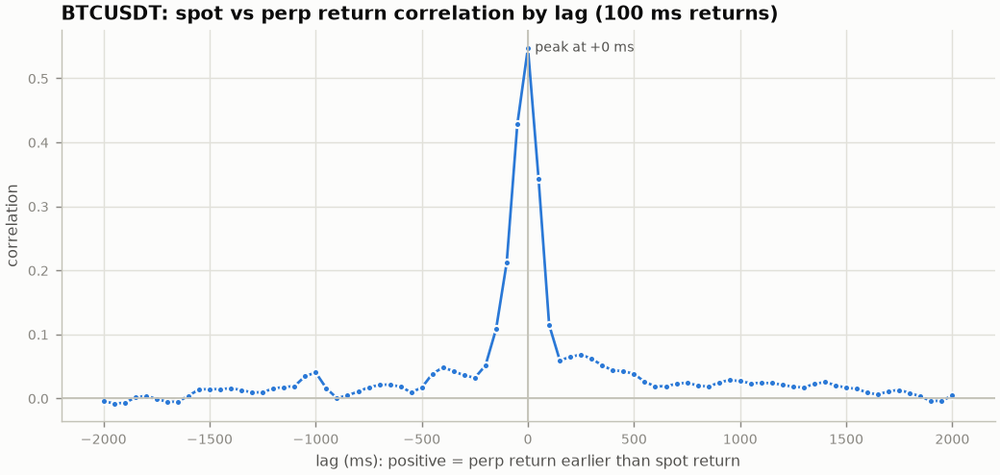
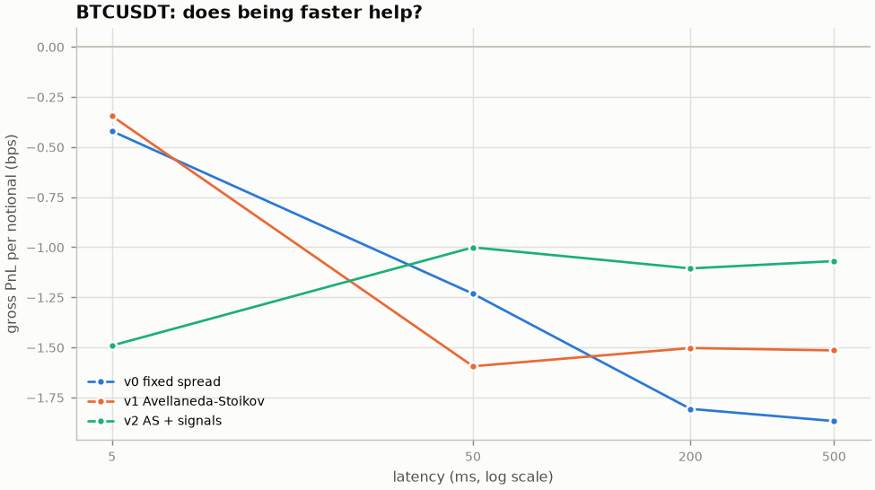
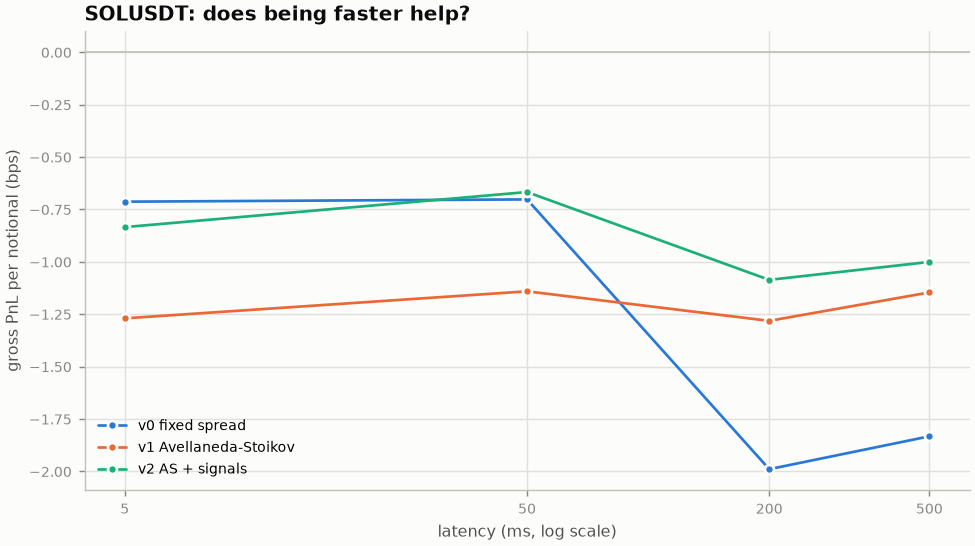
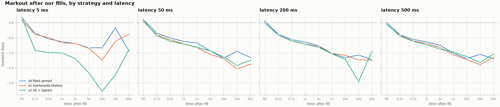
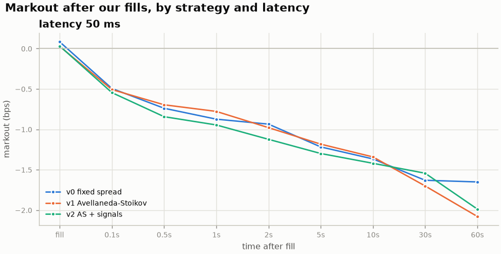
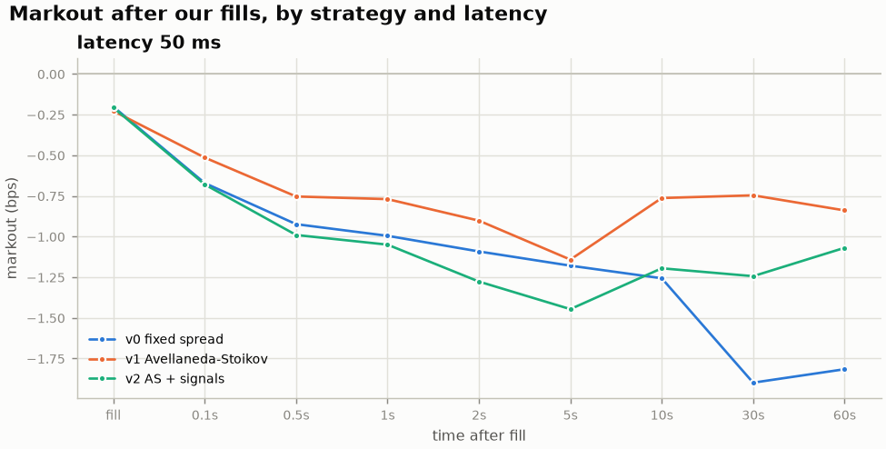
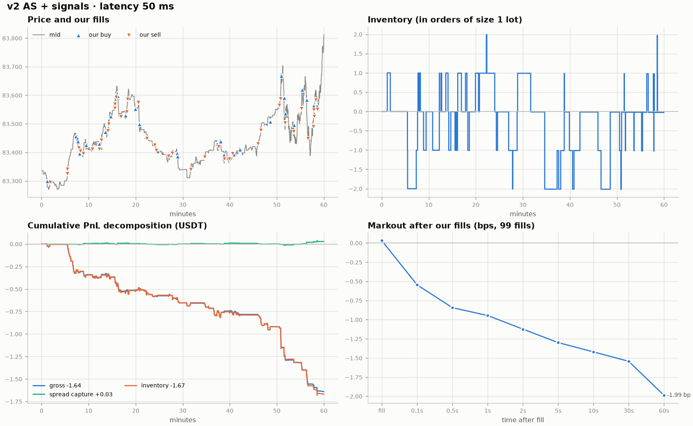

# Results: market making Binance BTC/USDT and SOL/USDT spot

All numbers come from one afternoon of real Binance data on 2026-09-28
(roughly 12:20 to 13:40 UTC), with virtual orders of 100 USDT per quote,
at most 5 orders of inventory, and no fees unless stated. They are an
illustration of the mechanics, not a statistically robust claim about the
market. Everything can be regenerated with `experiments/run_all.sh`.

## Protocol

| Step | Data | Purpose |
|---|---|---|
| 1. Calibration | minutes 0-20 of a 60-minute raw recording per symbol | signal research, choose `k`, `gamma` and the signal betas |
| 2. Out-of-sample replay | minutes 20-60 of the same recordings | strategy x latency sweep |
| 3. Live paper trading | a separate 60-minute live session per symbol, all three strategies side by side | fully out of sample, in real time |
| 4. Consistency check | replay of the live sessions' own recordings | must reproduce the live fills exactly |

Fixed parameters for every run: `k = 1` (base half spread about 1 bp),
`gamma = 0.05`, `tau = 30 s`, v0 half spread 1 bp, latency 50 ms unless swept.
Signal betas (v2) are the joint-regression slopes at the 1-second horizon on the
calibration window: BTC `beta_gap = 0`, `beta_imb = 0.25`; SOL `beta_gap = 0.08`,
`beta_imb = 0.6`.

## 1. Signals: the perp does not lead, book imbalance does predict

Correlation of 100 ms spot and perp returns peaks at **lag 0** in every
window, for both symbols (BTC 0.46 / 0.55, SOL 0.59 / 0.61 in the calibration /
out-of-sample windows). At the resolution this setup can see (50 ms grid,
about 55 ms of feed delay with jitter), the perpetual future does not move
first. The original hypothesis for v2 was wrong.

What does predict the next second of spot is the top-of-book size imbalance,
and it is stable out of sample:

| 1 s horizon, univariate | BTC calib. | BTC out-of-sample | SOL calib. | SOL out-of-sample |
|---|---:|---:|---:|---:|
| imbalance: beta (bp per unit), corr | 0.22, 0.33 | 0.22, 0.34 | 0.61, 0.33 | 0.52, 0.32 |
| perp-spot gap: beta, corr | 0.18, 0.23 | 0.25, 0.28 | 0.18, 0.13 | 0.26, 0.21 |
| joint regression: beta_imb / beta_gap | 0.23 / -0.01 | 0.17 / 0.10 | 0.59 / 0.06 | 0.46 / 0.11 |

The gap does predict spot on its own, but once imbalance is in the
regression it adds little: both mostly measure the same short-term pressure.
Full tables: [results/tables](results/tables).

## 2. Out-of-sample replay: strategy x latency (minutes 20-60)

Gross PnL per unit of traded notional, in bps (= the break-even maker fee):

| Latency | BTC v0 | BTC v1 | BTC v2 | SOL v0 | SOL v1 | SOL v2 |
|---:|---:|---:|---:|---:|---:|---:|
| 5 ms | -0.42 | -0.35 | -1.49 | -0.71 | -1.27 | -0.83 |
| 50 ms | -1.23 | -1.59 | **-1.00** | -0.70 | -1.14 | **-0.67** |
| 200 ms | -1.81 | -1.50 | **-1.11** | -1.99 | -1.28 | **-1.09** |
| 500 ms | -1.87 | -1.52 | **-1.07** | -1.83 | -1.15 | **-1.00** |

(v0 fixed spread, v1 Avellaneda-Stoikov, v2 AS + signals; fill counts range
from 13 to 463, see [results/tables/latency_BTC.md](results/tables/latency_BTC.md)
and [latency_SOL.md](results/tables/latency_SOL.md).)

Markouts are nearly identical across strategies and latencies: close to zero
at the fill, about **-1 bp five seconds later** (standard errors 0.1 to 0.4 bp).

## 3. Live paper trading (60 minutes, fully out of sample)

Two live sessions, 12:39 to 13:39 UTC, all three strategies quoting side by
side on the same stream (50 ms latency, parameters fixed before the session):

| | BTC v0 | BTC v1 | BTC v2 | SOL v0 | SOL v1 | SOL v2 |
|---|---:|---:|---:|---:|---:|---:|
| fills / orders sent | 279 / 2,553 | 123 / 2,793 | 99 / 3,483 | 682 / 4,049 | 206 / 4,523 | 184 / 5,227 |
| traded notional (USDT) | 24,900 | 11,600 | 9,000 | 42,370 | 12,569 | 11,222 |
| spread capture (bp) | +0.08 | +0.03 | +0.03 | -0.20 | -0.23 | -0.21 |
| inventory (bp) | -1.75 | -2.08 | -1.85 | -1.34 | -1.01 | -1.28 |
| **gross = break-even fee (bp)** | **-1.67** | **-2.05** | **-1.82** | **-1.54** | **-1.24** | **-1.49** |
| gross PnL (USDT) | -4.16 | -2.38 | -1.64 | -6.52 | -1.55 | -1.67 |
| markout at 5 s (bp, ± s.e.) | -1.22 ± 0.15 | -1.18 ± 0.19 | -1.30 ± 0.24 | -1.18 ± 0.14 | -1.14 ± 0.20 | -1.45 ± 0.20 |
| mean abs inventory (lots) | 2.91 | 0.59 | 0.58 | 3.16 | 0.39 | 0.31 |

One strategy in detail (BTC, v2): fills cluster where the price runs, the
spread-capture line stays flat at zero, and the whole loss is inventory that
moved against us after the fill.

Net PnL for the hour under different maker fees (USDT):

| Maker fee | BTC v0 | BTC v1 | BTC v2 | SOL v0 | SOL v1 | SOL v2 |
|---|---:|---:|---:|---:|---:|---:|
| retail spot, 10 bp | -29.06 | -13.98 | -10.64 | -48.89 | -14.12 | -12.89 |
| retail perp, 2 bp | -9.14 | -4.70 | -3.44 | -14.99 | -4.07 | -3.91 |
| zero | -4.16 | -2.38 | -1.64 | -6.52 | -1.55 | -1.67 |
| rebate, -0.5 bp (illustrative) | -2.91 | -1.80 | -1.19 | -4.40 | -0.93 | -1.11 |

Per-strategy reports: [results/tables](results/tables).

## 4. Replay reproduces live

Replaying each live session's own recording through the backtester
(`python -m mmsim reproduce`) gives the same fills: **1,573 of 1,573 fills
identical** in time, side, price, size and resulting position across both
symbols and all three strategies. The backtester and the live paper trader
are the same code path.

## What this says

1. **Naive market making on liquid Binance spot loses money before fees.**
   Every strategy, symbol and latency lost between 0.35 and 2.05 bp of traded
   notional, live and in replay. To break even you would need a maker
   *rebate* of 1.2 to 2 bp; at retail spot fees the loss is 6 to 9 times
   larger.
2. **The loss is adverse selection.** Spread capture at the moment of the
   fill is about zero, and the average fill is 1 to 1.5 bp under water five
   seconds later. Quotes a few bps from mid mostly get hit when the price is
   running through them.
3. **Inventory control reduces risk, not the per-trade problem.** v1 held 5 to
   8 times less inventory than v0 and lost less than half as many USDT in the
   hour (BTC -2.38 vs -4.16, SOL -1.55 vs -6.52), mostly by trading less. Per unit of notional it was better on SOL and worse
   on BTC.
4. **The imbalance signal is real but did not become a trading edge.** It
   explains about 11% of the variance of 1-second spot returns, stably out of
   sample. v2 beat v1 in 7 of 8 replay settings by 0.15 to 0.6 bp, but live it
   was slightly better on BTC and worse on SOL, and the markout differences sit
   within about one standard error. Shifting fair value by a fraction of a tick
   rarely changes a quote; acting on the signal probably needs pulling the
   quote on the thin side instead.
5. **Speed helps defensively but is not enough.** Lower latency means fewer
   stale quotes: fewer fills and, in most cases, smaller losses (BTC v0:
   -0.42 bp at 5 ms vs -1.87 bp at 500 ms; BTC v2 at 5 ms, with only 13 fills,
   is the exception). No latency turned any strategy profitable.
6. **The perp did not lead spot.** The first hypothesis for v2 was wrong at
   this resolution; the data pointed to book imbalance instead.

Caveats: one afternoon, two symbols, fills decided by a model (see the README
for its assumptions), feed timestamps about 55 ms behind the exchange.
